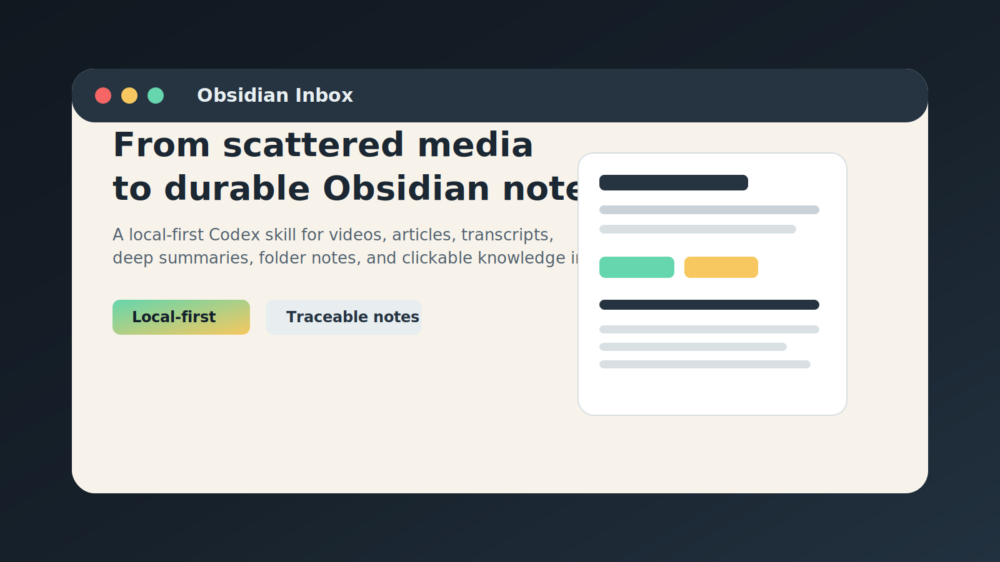
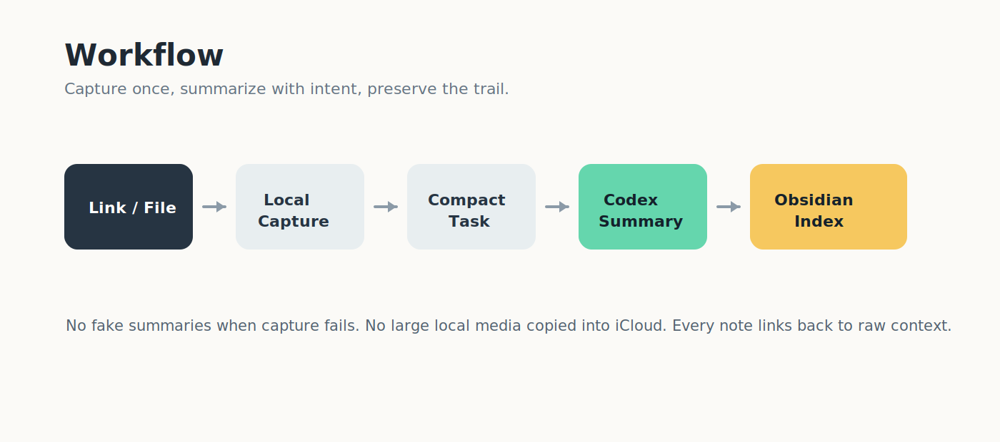
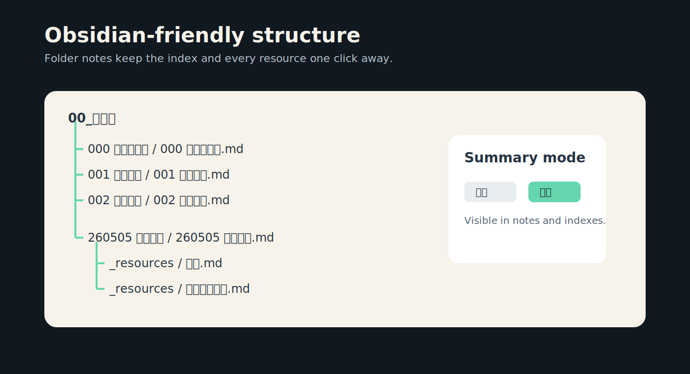

# Obsidian Inbox



[中文](#中文) | [English](#english)

<a id="中文"></a>
## 中文

`Obsidian Inbox` 是一个 local-first 的 Codex skill：把外部视频、文章、网页、微信内容和本地媒体整理成结构化 Obsidian Markdown 笔记，并自动维护可点击的资料库索引、主题索引和用途索引。

它不是一次性 AI 摘要工具。它更关注摘要之后的知识库工作流：资料放在哪里、以后怎么找回来、原文和转写能不能追溯、普通总结和深度总结能不能一眼区分。



### 解决什么问题

- 把链接、本地视频、文章和转写统一进入 Obsidian 资料库。
- 为每条资源生成一个主总结 MD，并把转写、正文、归档总结放进 `_resources/`。
- 维护三个入口：资料库索引、主题索引、用途索引。
- 支持普通总结和深度总结，适配“快速入库”和“课程/教学/系统整理”。
- 本地视频原文件、ASR 临时音频、cookies 不进入 Obsidian/iCloud，也不会被提交到 GitHub。
- 抓不到字幕或正文时保留失败状态，不编造总结。

### Obsidian 结构

索引使用 Folder Notes 友好的结构，能排在资源文件夹前面：

```text
00_资料库/000 资料库索引/000 资料库索引.md
00_资料库/001 主题索引/001 主题索引.md
00_资料库/002 用途索引/002 用途索引.md
```

单条资源结构：

```text
00_资料库/YYMMDD 短标题/YYMMDD 短标题.md
00_资料库/YYMMDD 短标题/_resources
```



### 快速开始

Clone 仓库：

```bash
git clone https://github.com/Simuiu/obsidian-inbox.git
cd obsidian-inbox
```

初始化你的 Obsidian Vault 路径：

```bash
python3 scripts/init_config.py --vault-path "/path/to/your/ObsidianVault" --force
```

检查依赖：

```bash
python3 scripts/doctor.py
```

普通入库：

```bash
python3 scripts/prepare_link.py "https://www.bilibili.com/video/BVxxxx" --sync-raw
```

深度入库：

```bash
python3 scripts/prepare_link.py "https://www.bilibili.com/video/BVxxxx" --sync-raw --mode deep
```

然后让 Codex 使用 skill 完成笔记：

```text
用 obsidian-inbox 处理最新任务包，写入 Obsidian，并重建索引。
```

### Codex Skill 用法

主要 skill 文件：

```text
.agents/skills/obsidian-inbox/SKILL.md
```

你可以对 Codex 说：

```text
把这个链接入库：https://...
```

或者：

```text
深度入库这个视频：https://...
```

旧的 `video2obsidian` skill 保留为兼容入口，但新流程建议使用 `obsidian-inbox`。

### 普通总结 vs 深度总结

普通总结用于快速入库和第一遍理解：

- 一句话总结
- 重点速览
- 核心内容
- 时间点或段落线索
- 行动清单
- 原始材料链接

深度总结用于课程、教学、系统整理、本地视频和明确要求“深度”的内容：

- 核心结论
- 问题链
- 概念地图
- 机制拆解
- 对比表
- 常见误区
- 设计取舍
- 实践路径
- 二次加工卡片

每篇主笔记会写入：

```yaml
summary_mode: "普通"
```

或：

```yaml
summary_mode: "深度"
```

索引页也会显示每条资源的总结模式。

### 能力状态

| 来源 | 状态 |
|---|---|
| Bilibili 视频 | 稳定：元数据、AI 字幕、普通/深度笔记 |
| 微信公众号 | 稳定：公开文章正文 Markdown |
| YouTube 视频 | 部分支持：依赖字幕可得性 |
| 普通网页 | 部分支持：保守 HTML 正文抽取 |
| 微信视频号 | 半自动：先用外部下载器捕获本地视频，再导入 |
| 本地视频/自有视频 | 支持：本地文件导入、转写导入、可选 ASR |
| 小红书 / 抖音 | 支持本地导出材料导入路径 |
| 音频 ASR | 实验可用，尚未作为稳定默认兜底 |

### 微信视频号

微信视频号不能稳定通过普通 URL 直接下载。当前集成方式是复用本地监听/代理下载器：

- `https://github.com/putyy/resd-mini`
- `https://github.com/putyy/res-downloader`
- `https://github.com/qiye45/wechatVideoDownload`

导入本地捕获的视频：

```bash
python3 scripts/import_wechat_video.py \
  --video "/path/to/video.mp4" \
  --source-url "<WECHAT_CHANNELS_URL>" \
  --title "视频标题" \
  --author "作者" \
  --asr
```

没有转写或 ASR 时，任务状态会保持为 `needs_asr`，不会生成假总结。

### 安全和隐私边界

本项目不会尝试绕过登录、验证码、付费墙或私有内容限制。

默认不会提交或同步：

- `tasks/`
- `models/`
- `tools/bin/`
- `config.yaml`
- `secrets/*.txt`
- cookies、本地视频、ASR 临时音频

公开发布前建议检查：

```bash
git status --short --ignored
```

### 文档

- 用户手册：`用户手册.md`
- 平台入库手册：`PLATFORM_INGESTION_MANUAL.md`
- 验收路径：`验收路径.md`
- 隐私与限制：`PRIVACY_AND_LIMITS.md`
- 开发计划：`DEVELOPMENT_PLAN.md`
- 规格文档：`OBSIDIAN_INBOX_SPEC.md`

---

<a id="english"></a>
## English

`Obsidian Inbox` is a local-first Codex skill that turns external videos, articles, web pages, WeChat content, and local media into structured Obsidian Markdown notes. It also maintains clickable library, topic, and purpose indexes.

It is not a one-off AI summarizer. It focuses on the workflow after summarization: where the note lives, how you find it later, whether the transcript/source remains traceable, and whether standard vs deep notes are easy to tell apart.


### What It Solves

- Ingest links, local videos, articles, and transcripts into one Obsidian library.
- Create one main summary note per resource, with transcripts, source text, and archived summaries under `_resources/`.
- Maintain three entry points: library index, topic index, and purpose index.
- Support standard and deep summaries for both quick capture and serious study.
- Keep local videos, temporary ASR audio, cookies, and machine-specific config out of Obsidian/iCloud and GitHub.
- Preserve failure states instead of inventing summaries when subtitles or article body are unavailable.

### Obsidian Structure

Indexes use a Folder Notes-friendly layout so they can stay above resource folders:

```text
00_资料库/000 资料库索引/000 资料库索引.md
00_资料库/001 主题索引/001 主题索引.md
00_资料库/002 用途索引/002 用途索引.md
```

Each resource gets its own folder:

```text
00_资料库/YYMMDD Short Title/YYMMDD Short Title.md
00_资料库/YYMMDD Short Title/_resources
```


### Quickstart

Clone the repository:

```bash
git clone https://github.com/Simuiu/obsidian-inbox.git
cd obsidian-inbox
```

Configure your Obsidian Vault path:

```bash
python3 scripts/init_config.py --vault-path "/path/to/your/ObsidianVault" --force
```

Check dependencies:

```bash
python3 scripts/doctor.py
```

Prepare a standard ingestion task:

```bash
python3 scripts/prepare_link.py "https://www.bilibili.com/video/BVxxxx" --sync-raw
```

Prepare a deep ingestion task:

```bash
python3 scripts/prepare_link.py "https://www.bilibili.com/video/BVxxxx" --sync-raw --mode deep
```

Then ask Codex to finish the note:

```text
Use the obsidian-inbox skill to process the latest task package, write the Obsidian note, and rebuild indexes.
```

### Codex Skill Usage

Main skill file:

```text
.agents/skills/obsidian-inbox/SKILL.md
```

Example prompts:

```text
Ingest this link into Obsidian: https://...
```

```text
Deep-ingest this video: https://...
```

The old `video2obsidian` skill is kept as a compatibility alias. New workflows should use `obsidian-inbox`.

### Standard vs Deep Notes

Standard notes are for quick capture and first-pass understanding:

- one-line summary
- key points
- core content
- timestamp or paragraph clues
- action items
- source links

Deep notes are for courses, teaching material, systematized learning, local videos, and explicit deep-summary requests:

- core conclusion
- problem chain
- concept map
- mechanism breakdown
- comparison table
- common misconceptions
- design tradeoffs
- practice path
- reusable atomic cards

Each main note includes:

```yaml
summary_mode: "普通"
```

or:

```yaml
summary_mode: "深度"
```

Indexes also show the summary mode for every resource.

### Capability Status

| Source | Status |
|---|---|
| Bilibili videos | Stable: metadata, AI subtitles, standard/deep notes |
| WeChat official account articles | Stable: public article body to Markdown |
| YouTube videos | Partial: depends on subtitle availability |
| Generic web pages | Partial: conservative HTML extraction |
| WeChat Channels | Semi-automatic: capture local video first, then import |
| Local/self-owned videos | Supported: local file import, transcript import, optional ASR |
| Xiaohongshu / Douyin | Supported through local export/import paths |
| Audio ASR | Experimental; not a stable default fallback yet |

### WeChat Channels

WeChat Channels videos cannot be reliably downloaded through a normal URL. The current workflow reuses local proxy/listener downloaders:

- `https://github.com/putyy/resd-mini`
- `https://github.com/putyy/res-downloader`
- `https://github.com/qiye45/wechatVideoDownload`

Import a captured local video:

```bash
python3 scripts/import_wechat_video.py \
  --video "/path/to/video.mp4" \
  --source-url "<WECHAT_CHANNELS_URL>" \
  --title "Video title" \
  --author "Author" \
  --asr
```

Without a transcript or ASR result, the task remains `needs_asr` and no fake summary is generated.

### Safety and Privacy Boundaries

This project does not bypass logins, captchas, paywalls, or private-content restrictions.

The following are ignored by default:

- `tasks/`
- `models/`
- `tools/bin/`
- `config.yaml`
- `secrets/*.txt`
- cookies, local videos, temporary ASR audio

Before publishing, check:

```bash
git status --short --ignored
```

### Documentation

- User manual: `用户手册.md`
- Platform ingestion manual: `PLATFORM_INGESTION_MANUAL.md`
- Acceptance checklist: `验收路径.md`
- Privacy and limits: `PRIVACY_AND_LIMITS.md`
- Development plan: `DEVELOPMENT_PLAN.md`
- Product spec: `OBSIDIAN_INBOX_SPEC.md`
